<head>
  <link href="https://fonts.googleapis.com/css2?family=Pacifico&display=swap" rel="stylesheet">
</head>

    

    
    
    

 

<h1 align="center">💫 About Me</h1>

    

    👨‍💻 Passionate about bringing ideas to life with code. 
    Detail-oriented problem solver who enjoys creating useful, real-world solutions.
    

    

    👾 Always tweaking the development setup to make coding smoother and more enjoyable. 
    If there's a better way to do it, I'll figure it out.
    

     

    👀 Always curious, I enjoy exploring new tech, picking up new skills,  and tackling challenges that push me further.
    

     

    🚀 Feel free to explore my repositories, where you'll find a mix of  personal projects, experiments, and collaborations.
    

 

<!-- 
 -->

<h1 align="center">🛠️ Tech Stack</h1>

    <h3>⚡️ Main Stack</h3>
    

        
        
        
        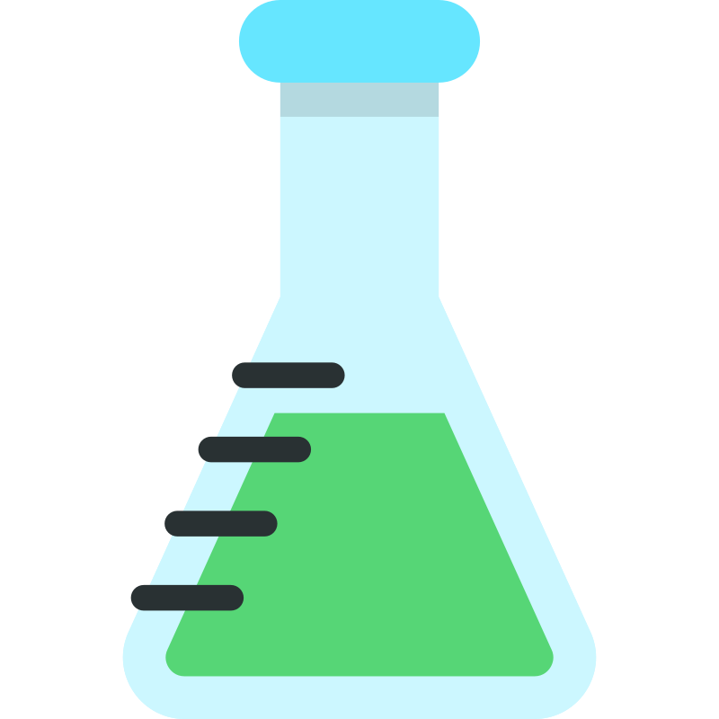
    

    

        
        
        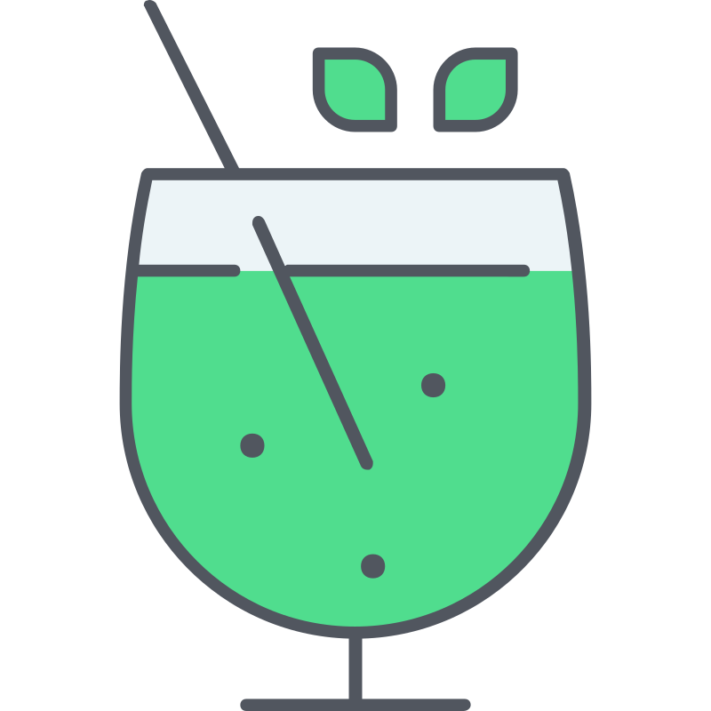
        
        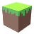
    

    

        
        
        
        
        
        
        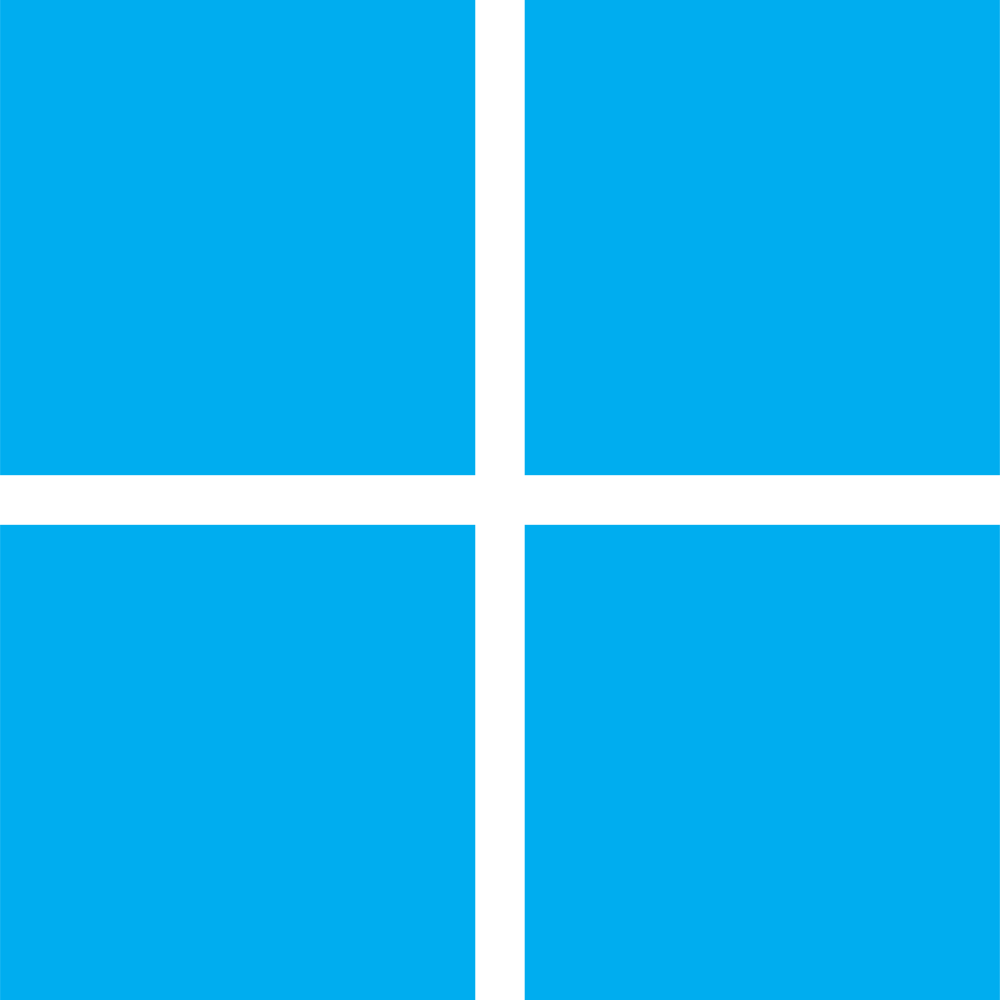
    

     

        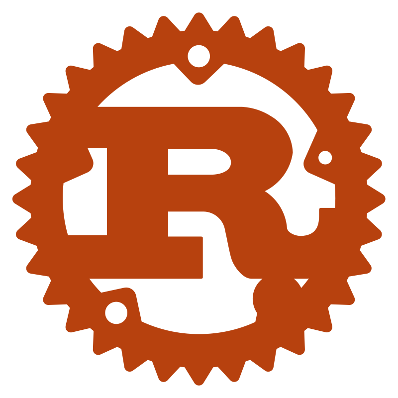
        
        
        
        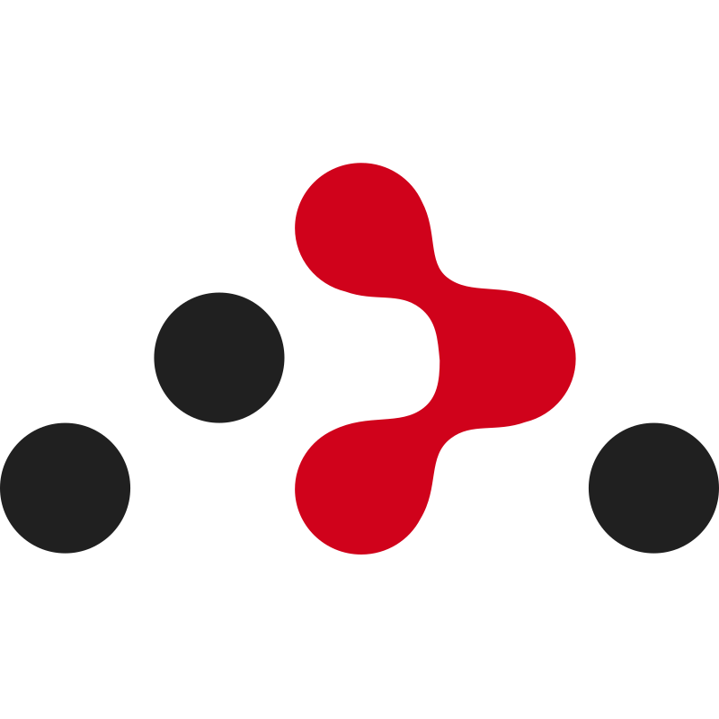
        
        
        
        
    

    <h3>🧰 Additional Tech</h3>
    

    

     

        
        
        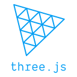
        
        
    

    

        
        
        
        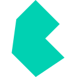
        
        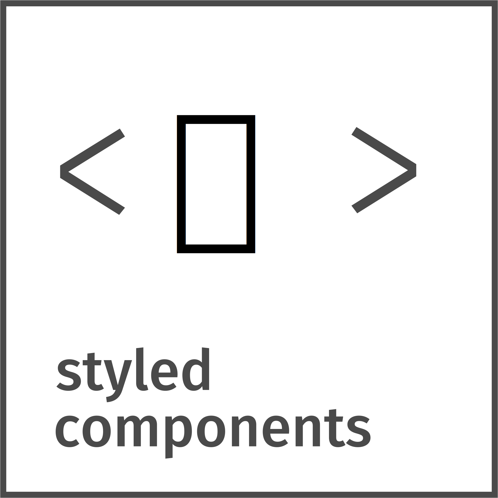
    

    

        
        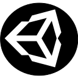
        
        
        
        
        
    

    

        
        
        
        
        
        
        
    

<!-- 
 -->
 

<h1 align="center">🦉 Owl's Workshop</h1>

    

        <h2>🎸 Book of Frets</h2>
        

            <a href="https://github.com/TheAncientOwl/book-of-frets">🎸 BookOfFrets</a>
            &nbsp;|&nbsp;
            <a href="https://book-of-frets.com">🎸 Live</a>
        

        <h3>🛠️ Tech Stack</h3>
        

            
            
            
            
            
            
        

        <h3>📌 Summary</h3>
        
🎶 <b>Book of Frets</b> is an interactive app for exploring and practicing guitar chords and songs. 
        💡 Enjoy a modern, responsive interface designed for musicians. 
        🎵 <b>Songs Viewer:</b> See songs with accurate fret positions to master finger placements. 
        🎼 <b>Chords:</b> Browse a rich library of clear chord diagrams. 
        📂 <b>Song List:</b> Navigate easily through a growing collection of songs. 
        🎨 <b>Themes:</b> Personalize the app with multiple visual themes. 
        📺 <b>Video Tutorials:</b> Learn songs with step-by-step video guidance.

    

    

        <h2>☕🪵 OopsieLogsy</h2>
        

            <a href="https://github.com/TheAncientOwl/oopsie-logsy">☕🪵 OopsieLogsy</a>
        

        <h3>🛠️ Tech Stack</h3>
        

            
            
            
            
            
            
            
        

        <h3>📌 Summary</h3>
        
🪵 <b>OopsieLogsy</b> is a fast and lightweight log viewer built for exploring very large text log files. 
        🔎 It uses <b>regex‑based parsing</b> to split log lines into structured columns, making logs easier to read and analyze. 
        ⚡ Designed with performance in mind, OopsieLogsy provides smooth scrolling, filtering, and quick navigation through massive logs.

    

    

        <h2>🪶 Feather Project</h2>
        

            <a href="https://github.com/TheAncientOwl/feather-core">🪶 FeatherCore</a>
            &nbsp;|&nbsp;
            <a href="https://github.com/TheAncientOwl/feather-toolkit">🪶🛠️FeatherToolkit</a>
            &nbsp;|&nbsp;
            <a href="https://github.com/TheAncientOwl/feather-showcase">✨ FeatherShowcase</a>
            &nbsp;|&nbsp;
            <a href="https://github.com/TheAncientOwl/quill">🪶📜 Quill</a>
        

        <h3>🛠️ Tech Stack</h3>
        

            
            
            
            
            
            
        

        <h3>📌 Summary</h3>
       
✨ <i>Creating <a href="https://papermc.io/">Paper-Spigot plugins</a> has never been easier!</i> 🪶
        <b>Feather Project</b> streamlines development, providing seamless integration tools to improve your workflow. 
        🛠️ The <a href="https://github.com/TheAncientOwl/feather-core">FeatherCore plugin</a>, built with the <a href="https://github.com/TheAncientOwl/feather-toolkit">feather-toolkit</a>, demonstrates its full potential. 

    

    

        <h2>🌙 LunarDB</h2>
        

            <a href="https://github.com/TheAncientOwl/lunardb">🌕 LunarDB</a>
            &nbsp;|&nbsp;
            <a href="https://github.com/TheAncientOwl/lunardb/blob/main/Moonlight.md">🌙 Moonlight</a>
            &nbsp;|&nbsp;
            <a href="https://github.com/TheAncientOwl/lunardb-js">🌕 LunarDB-JS</a>
            &nbsp;|&nbsp;
            <a href="https://github.com/TheAncientOwl/astro-huddle">🚀 AstroHuddle</a>
        

        <h3>🛠️ Tech Stack</h3>
        

            
            
            
            
            
            
        

        <h3>📌 Summary</h3>
        
🌙 <b>LunarDB</b> is a flexible and scalable database management system, developed as part of my <i>Master's Degree Project</i>. 🗂️ It provides versatile data handling, normalization options, high performance, and a developer-friendly API. ✨ Supporting both structured and unstructured data, LunarDB is ideal for a wide range of applications.

    

    

        <h2>🥭📊 Mango Analysis</h2>
        

            <a href="https://github.com/TheAncientOwl/mango-analysis">🥭 MangoAnalysis</a>
        

        <h3>🛠️ Tech Stack</h3>
        

            
            
            
            
            
            
        

        

            
            
            
            
            
            
            
        

        <h3>📌 Summary</h3>
        
🗂️ MangoAnalysis is a data analysis tool for CSV databases, developed as part of my <i>Bachelor's Degree Project</i>. 📊 It features a user-friendly interface with powerful analysis techniques such as  <a href="https://en.wikipedia.org/wiki/Principal_component_analysis">Principal Components Analysis</a>, <a href="https://en.wikipedia.org/wiki/Factor_analysis">Factor Analysis</a>, <a href="https://en.wikipedia.org/wiki/Regression_analysis">Regression Models</a>, and <a href="https://github.com/TheAncientOwl/mango-analysis?tab=readme-ov-file#-modules">more</a>. 🛠️ Built using React, Electron, and Python Flask, this cross-platform application allows users to  explore, visualize, and interpret data to uncover valuable insights. ✨ Whether you're a researcher or analyst, MangoAnalysis helps you make informed decisions with ease.
        

    

<!-- <h2 align="center">🔥Stats</h2>

  

 -->

<!-- <h2 align="center">💻 Work Machine</h2>

  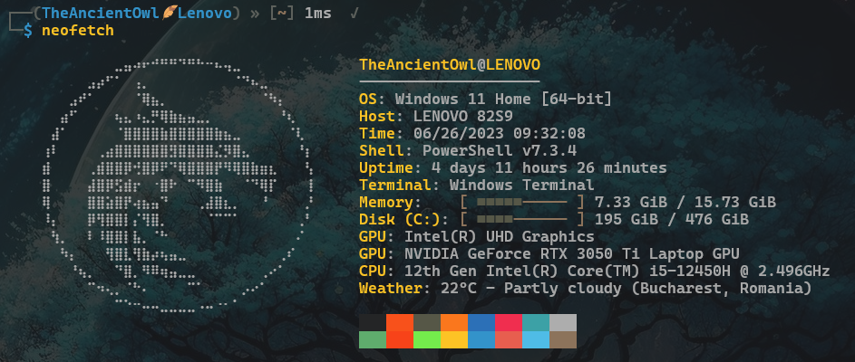

 -->
