

  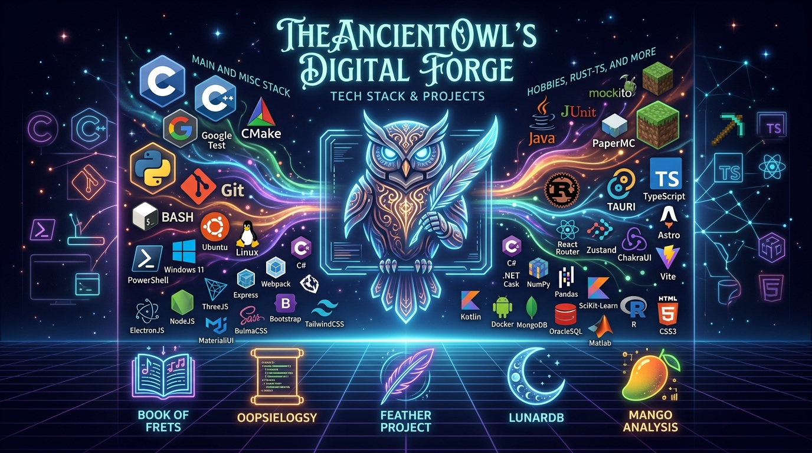

  
  
  

<h1 align="center">💫 About Me</h1>

  👨‍💻 Passionate about bringing ideas to life with code. 
  Detail-oriented problem solver who enjoys creating useful, real-world solutions.

  👾 Always tweaking the development setup to make coding smoother and more enjoyable. 
  If there's a better way to do it, I'll figure it out.

  👀 Always curious, I enjoy exploring new tech, picking up new skills, and tackling challenges that push me further.

  🚀 Feel free to explore my repositories, where you'll find a mix of personal projects, experiments, and collaborations.

 

<h1 align="center">🛠️ Tech Stack</h1>

<h3 align="center">⚡️ Main Stack</h3>

  
  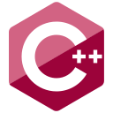
  
  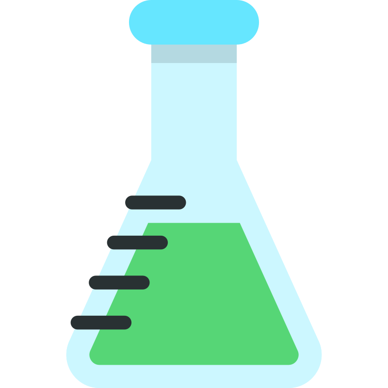

  
  
  
  
  
  
  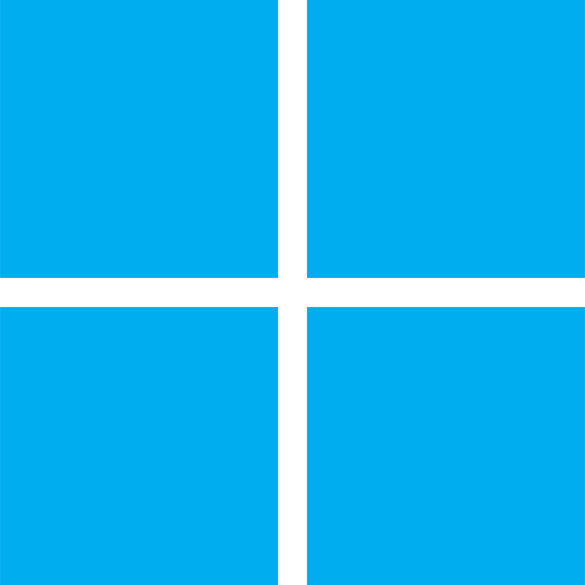

<h3 align="center">🎮 Hobbies Stack</h3>

  
  
  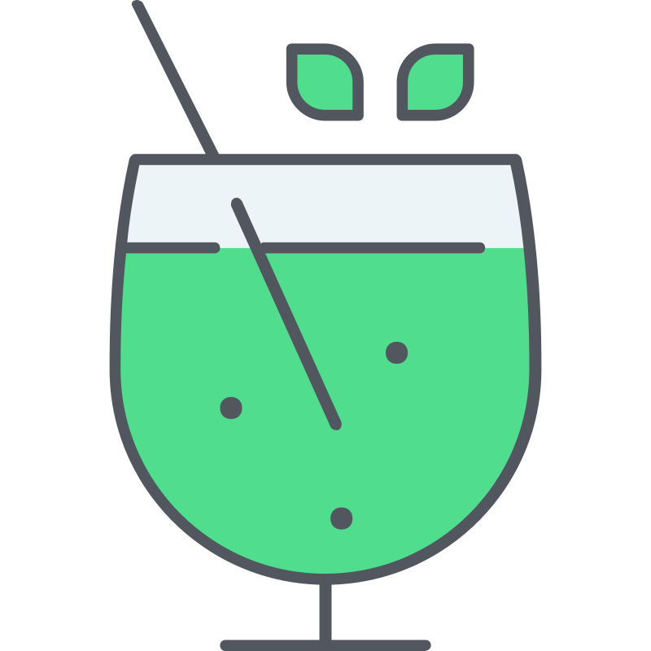
  
  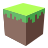

  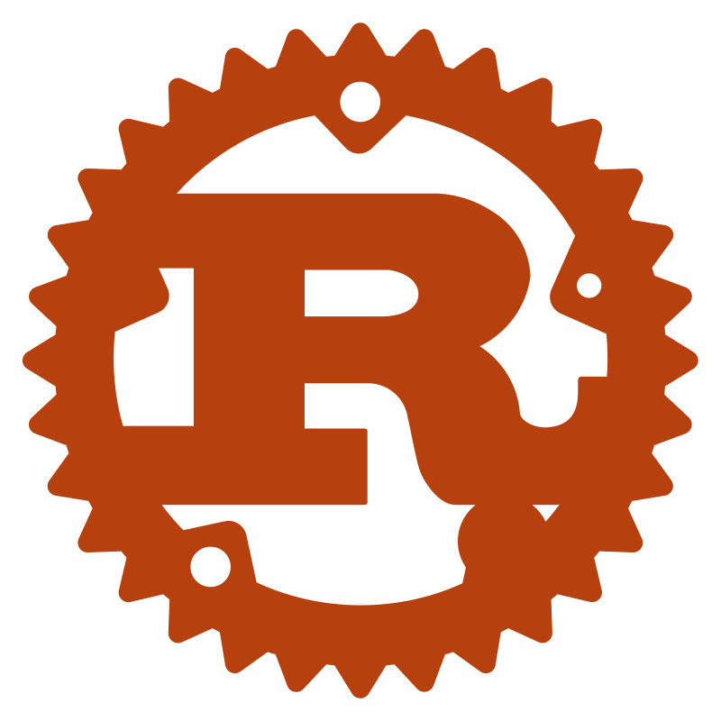
  
  
  
  
  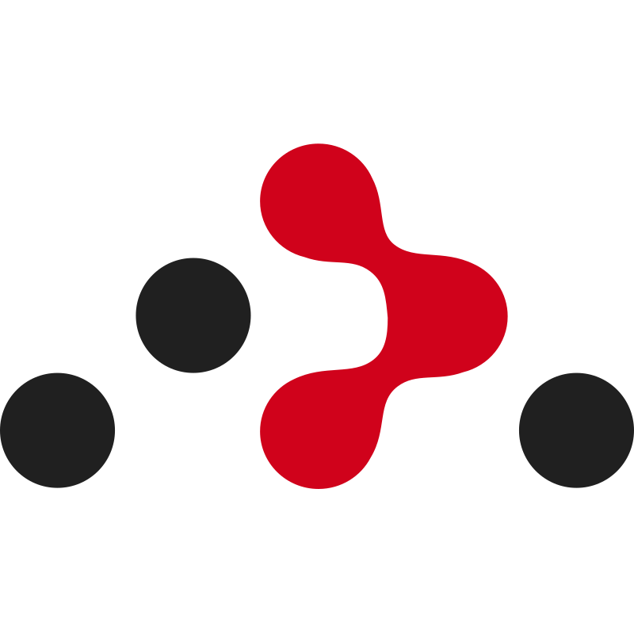
  
  
  
  

<h3 align="center">🧰 Other Tech</h3>

  
  
  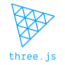
  
  

  
  
  
  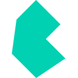
  
  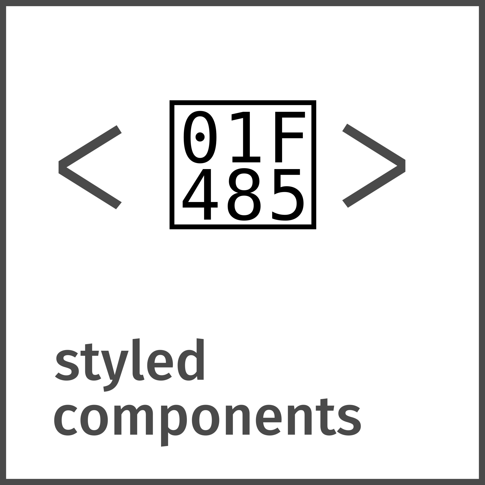

  
  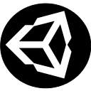
  
  
  
  
  

  
  
  
  
  
  
  

 
 

<h1 align="center">🦉 Owl's Workshop</h1>

<h2 align="center">🎸 Book of Frets</h2>

  <a href="https://github.com/TheAncientOwl/book-of-frets">🎸 BookOfFrets</a> | 
  <a href="https://github.com/TheAncientOwl/book-of-frets-x">🎸 BookOfFrets-X</a> | 
  <a href="https://book-of-frets.com">🎸 Live</a>

<h3 align="center">🛠️ Tech Stack - X</h3>

  
  
  
  
  
  

<h3 align="center">🛠️ Tech Stack</h3>

  
  
  
  
  
  

<h3 align="center">📌 Summary</h3>

  🎶 <b>Book of Frets</b> is an interactive app for exploring and practicing guitar chords and songs. 
  💡 Enjoy a modern, responsive interface designed for musicians. 
  🎵 <b>Songs Viewer:</b> See songs with accurate fret positions to master finger placements. 
  🎼 <b>Chords:</b> Browse a rich library of clear chord diagrams. 
  📂 <b>Song List:</b> Navigate easily through a growing collection of songs. 
  🎨 <b>Themes:</b> Personalize the app with multiple visual themes. 
  📺 <b>Video Tutorials:</b> Learn songs with step-by-step video guidance.

 

<h2 align="center">☕🪵 OopsieLogsy</h2>

  <a href="https://github.com/TheAncientOwl/oopsie-logsy">☕🪵 OopsieLogsy</a>

<h3 align="center">🛠️ Tech Stack</h3>

  
  
  
  
  
  
  

<h3 align="center">📌 Summary</h3>

  🪵 <b>OopsieLogsy</b> is a fast and lightweight log viewer built for exploring very large text log files. 
  🔎 It uses <b>regex‑based parsing</b> to split log lines into structured columns, making logs easier to read and analyze. 
  ⚡ Designed with performance in mind, OopsieLogsy provides smooth scrolling, filtering, and quick navigation through massive logs.

 

<h2 align="center">🪶 Feather Project</h2>

  <a href="https://github.com/TheAncientOwl/feather-core">🪶 FeatherCore</a> | 
  <a href="https://github.com/TheAncientOwl/feather-toolkit">🪶🛠️ FeatherToolkit</a> | 
  <a href="https://github.com/TheAncientOwl/feather-showcase">✨ FeatherShowcase</a> | 
  <a href="https://github.com/TheAncientOwl/quill">🪶📜 Quill</a>

<h3 align="center">🛠️ Tech Stack</h3>

  
  
  
  
  
  

<h3 align="center">📌 Summary</h3>

  ✨ <i>Creating <a href="https://papermc.io/">Paper-Spigot plugins</a> has never been easier!</i> 
  🪶 <b>Feather Project</b> streamlines development, providing seamless integration tools to improve your workflow. 
  🛠️ The <a href="https://github.com/TheAncientOwl/feather-core">FeatherCore plugin</a>, built with the <a href="https://github.com/TheAncientOwl/feather-toolkit">feather-toolkit</a>, demonstrates its full potential.

 

<h2 align="center">🌙 LunarDB</h2>

  <a href="https://github.com/TheAncientOwl/lunardb">🌕 LunarDB</a> | 
  <a href="https://github.com/TheAncientOwl/lunardb/blob/main/Moonlight.md">🌙 Moonlight</a> | 
  <a href="https://github.com/TheAncientOwl/lunardb-js">🌕 LunarDB-JS</a> | 
  <a href="https://github.com/TheAncientOwl/astro-huddle">🚀 AstroHuddle</a>

<h3 align="center">🛠️ Tech Stack</h3>

  
  
  
  
  
  

<h3 align="center">📌 Summary</h3>

  🌙 <b>LunarDB</b> is a flexible and scalable database management system, developed as part of my <i>Master's Degree Project</i>. 
  🗂️ It provides versatile data handling, normalization options, high performance, and a developer-friendly API. 
  ✨ Supporting both structured and unstructured data, LunarDB is ideal for a wide range of applications.

 

<h2 align="center">🥭📊 Mango Analysis</h2>

  <a href="https://github.com/TheAncientOwl/mango-analysis">🥭 MangoAnalysis</a>

<h3 align="center">🛠️ Tech Stack</h3>

  
  
  
  
  
  

  
  
  
  
  
  
  

<h3 align="center">📌 Summary</h3>

  🗂️ MangoAnalysis is a data analysis tool for CSV databases, developed as part of my <i>Bachelor's Degree Project</i>. 
  📊 It features a user-friendly interface with powerful analysis techniques such as 
  <a href="https://en.wikipedia.org/wiki/Principal_component_analysis">Principal Components Analysis</a>, <a href="https://en.wikipedia.org/wiki/Factor_analysis">Factor Analysis</a>, <a href="https://en.wikipedia.org/wiki/Regression_analysis">Regression Models</a>, and <a href="https://github.com/TheAncientOwl/mango-analysis?tab=readme-ov-file#-modules">more</a>. 
  🛠️ Built using React, Electron, and Python Flask, this cross-platform application allows users to  explore, visualize, and interpret data to uncover valuable insights. 
  ✨ Whether you're a researcher or analyst, MangoAnalysis helps you make informed decisions with ease.

