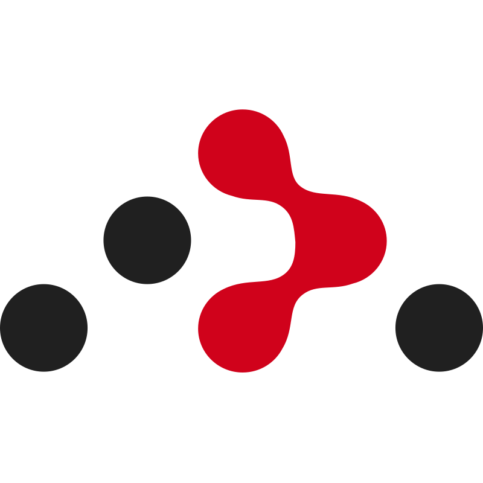

<head>
  <link href="https://fonts.googleapis.com/css2?family=Pacifico&display=swap" rel="stylesheet">
</head>

    

    
    
    

 

<h1 align="center">💫 About Me</h1>

  

    👨‍💻 I'm a passionate IT professional who finds great joy bringing ideas to life through coding. 
     
    With a keen eye for detail and a love for problem-solving, I strive to create impactful solutions.
  

  

    👾 I enjoy customizing every aspect of the development environment. I believe in   tailoring my tools to enhance productivity and foster a delightful coding experience.
  

  

    👀 My curiosity knows no bounds, and I'm always eager to learn new technologies and tools.  I embrace challenges that require me to expand my skill set and I'm ready to dive into  the depths of emerging technologies if the need arises, staying ahead of the curve.
  

🚀 Feel free to explore my repositories, where you'll find a mix of  personal projects, experiments, and collaborations.

 

<h1 align="center">🛠️ Tech Stack</h1>

    <h3>⚡️ Core</h3>
    

        
        
        
        
    

    

        
        
        
        
        
    

    

        
        
        
        
        
        
        
    

     

        
        
        
        
        
        
        
    

    <h3>✨ Also Used</h3>
    

    

    

        
        
        
        
        
        
        
        
        
    

    

        
        
        
        
        
        
    

    

        
        
        
        
        
        
    

    

        
        
        
    

    

        
        
    

    

        
        
        
    

    

        
        
        
    

<h1 align="center">🦉 Owl’s Workshop</h1>

    

        <h2>🎸 Book of Frets</h2>
        

            <a href="https://github.com/TheAncientOwl/book-of-frets">🎸 BookOfFrets</a>
            <a href="https://book-of-frets.com">🎸 Live</a>
        

        <h3>🛠️ Tech Stack</h3> 
        

            
            
            
            
            
        

        <h3>📌 Summary</h3>
        
🶠Book of Frets is an interactive web app built to visualize, practice, and explore guitar chords and songs. 
        💡 Developed with TypeScript, React, and Chakra UI, it provides a modern, responsive interface for musicians. 
        🵠Songs Viewer: Visualize songs with precise fret positions to help you learn finger placements. 
        🼠Chords: Access a rich library of chords with clear diagrams. 
        📂 Song List: Easily navigate through a growing collection of songs. 
        🨠Themes: Customize the look and feel of the app with various themes. 
        📺 Video Resources: Learn how to play songs with helpful video tutorials.

    

    

        <h2>🪶 Feather Project</h2>
        

            <a href="https://github.com/TheAncientOwl/feather-core">🪶 FeatherCore</a>
            &nbsp;|&nbsp;
            <a href="https://github.com/TheAncientOwl/feather-toolkit">🪶🛠️FeatherToolkit</a>
            &nbsp;|&nbsp;
            <a href="https://github.com/TheAncientOwl/feather-showcase">✨ FeatherShowcase</a>
            &nbsp;|&nbsp;
            <a href="https://github.com/TheAncientOwl/quill">🪶📜 Quill</a>
        

        <h3>🛠️ Tech Stack</h3>
        

            
            
            
            
            
        

        <h3>📌 Summary</h3>
        
✨ <i>Building <a href="https://papermc.io/">Paper-Spigot plugins</a> was never easier!</i> 🪶 Feather Project is designed to simplify the development process,  offering smooth integration tools to enhance the developer experience. 🛠️ The <a href="https://github.com/TheAncientOwl/feather-core">FeatherCore plugin</a> is built using the <a href="https://github.com/TheAncientOwl/feather-toolkit">feather-toolkit</a> to showcase its capabilities.
         
    

    

        <h2>🌙 Lunar DB</h2>
        

            <a href="https://github.com/TheAncientOwl/lunardb">🌕 LunarDB</a>
            &nbsp;|&nbsp;
            <a href="https://github.com/TheAncientOwl/lunardb/blob/main/Moonlight.md">🌙 Moonlight</a>
            &nbsp;|&nbsp;
            <a href="https://github.com/TheAncientOwl/lunardb-js">🌕 LunarDB-JS</a>
            &nbsp;|&nbsp;
            <a href="https://github.com/TheAncientOwl/astro-huddle">🚀 AstroHuddle</a>
        

        <h3>🛠️ Tech Stack</h3>
        

            
            
            
            
            
            
        

        <h3>📌 Summary</h3>
        
🌙 LunarDB is a database management system designed for flexibility and scalability developed as part of my <i>Master's Degree Project</i>. 🗂️ It offers versatile data handling, normalization options, high performance, and a developer-friendly API. ✨ It supports both structured and unstructured data, making it suitable for a wide range of applications.
        

    

    

        <h2>🥭📊 Mango Analysis</h2>
        

            <a href="https://github.com/TheAncientOwl/mango-analysis">🥭 MangoAnalysis</a>
        

        <h3>🛠️ Tech Stack</h3>
        

            
            
            
            
            
            
        

        

            
            
            
            
            
            
        

        

            
            
            
            
            
            
            
        

        <h3>📌 Summary</h3>
        
🗂️ MangoAnalysis is a data analysis tool for CSV databases, developed as part of my <i>Bachelor's Degree Project</i>. 📊 It features a user-friendly interface with powerful analysis techniques such as  <a href="https://en.wikipedia.org/wiki/Principal_component_analysis">Principal Components Analysis</a>, <a href="https://en.wikipedia.org/wiki/Factor_analysis">Factor Analysis</a>, <a href="https://en.wikipedia.org/wiki/Regression_analysis">Regression Models</a>, and <a href="https://github.com/TheAncientOwl/mango-analysis?tab=readme-ov-file#-modules">more</a>. 🛠️ Built using React, Electron, and Python Flask, this cross-platform application allows users to  explore, visualize, and interpret data to uncover valuable insights. ✨ Whether you're a researcher or analyst, MangoAnalysis helps you make informed decisions with ease.
        

    

<!-- <h2 align="center">🔥Stats</h2>

  

 -->

<!-- <h2 align="center">💻 Work Machine</h2>

  

 -->
